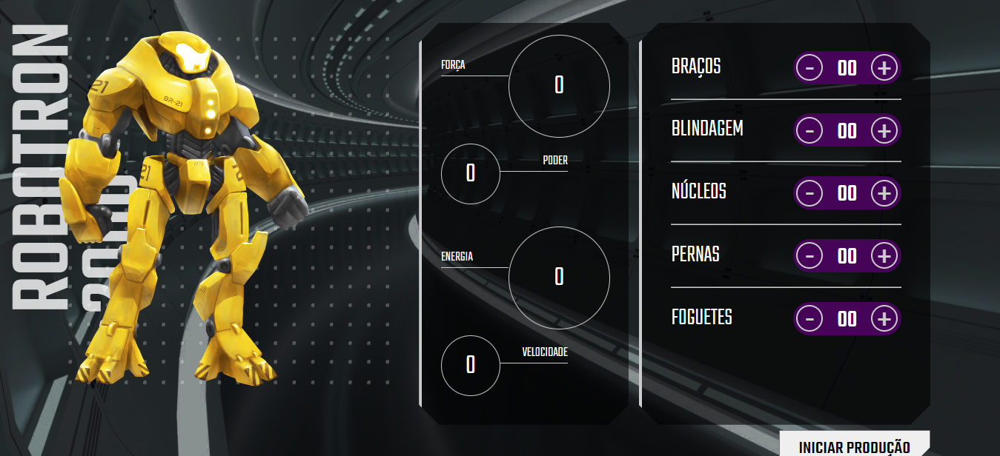

# ROBOTRON 2000

Projeto do curso <b>"JavaScript: manipulando o DOM"</b> da Alura, que consiste na criação de uma interface para produção de robôs do tipo Robotron 2000, utilizando <b>HTML, CSS e JavaScript</b>.

<h3>Contribuindo</h3>

⭐️ Star o projeto

🐛 Encontrar e relatar issues

